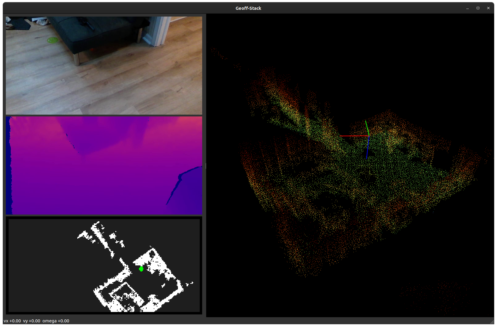

# Geoff-Stack 🚀 — Unified Control & Perception for the Unitree G-1

`run_geoff_gui.py` is the **single entry-point** that welds together *all* helper scripts in this repository into one cohesive, operator-friendly user interface.  This README gives you the 30 000 ft view first, then dives into each building-block so you can tweak, extend or debug the stack with confidence.

> **TL;DR** – Already have the Jetson streaming and the LiDAR plugged in?
> 
> ```bash
> python3 run_geoff_gui.py  --iface enp68s0f1   # or the NIC that faces the robot
> ```
> 
> A PySide6 window pops up showing RGB, depth, a 2-D occupancy preview and a fully interactive 3-D point-cloud.  Drive with **W A S D Q E** (shift for turbo) and enjoy.

<p align="center">
  
</p>

---

## 1. Bird-eye architecture

```text
┌───────────────────────────── Sensors ───────────────────────────────┐
│  RealSense D435i        Livox MID-360           Unitree IMU/BMS     │
│        │ USB3               │ UDP                     │ DDS         │
└────┬───┴────────────────────┴─────────────────────────┴─────────────┘
     │ Jetson Xavier NX (on the robot)
     │   jetson_realsense_stream.py   livox2_python.py  unitree_sdk
     └───────────────┬──────────────────────────┬────────────────────┘
                     │ RTP/H264                 │ custom UDP & DDS  
                     ▼                          ▼                   
               ┌──────────────────────────────────────────┐          
               │           Laptop / Ground-station        │          
               │                                          │          
               │  _rx_realsense   live_slam   _rx_battery │          
               │          ↘        ↙          ↙           │          
               │            Shared State (thread-safe)    │          
               │                     │                     │          
               │              run_geoff_gui.py             │          
               └──────────────────────────────────────────┘          
```

Everything below runs **without ROS** – plain Python threads talk through a minimal `dict` guarded by a `threading.Lock`.  Heavy lifting (RealSense decoding, SLAM ICP) happens off the GUI thread so the window stays smooth.

---

## 2. The main window (`run_geoff_gui.py`)

```
┌───────────────┐  ┌───────────────────────────────────────────────┐
│   RGB 640×480 │  │         3-D SLAM  (pyqtgraph.GLViewWidget)   │
├───────────────┤  │                                               │
│ Depth 640×480 │  │  – rotate / zoom / click-to-pick coming soon –│
├───────────────┤  └───────────────────────────────────────────────┘
│ 2-D occupancy │
└───────────────┘
```

The **Qt** event-loop lives in the main thread and is complemented by three background workers that continuously push data into shared memory:

| Thread            | Module/function            | Duties |
|-------------------|----------------------------|---------|
| RealSense RX      | `_rx_realsense`            | Pull two RTP streams (RGB & colour-mapped depth) via GStreamer and expose a stacked 1280×480 BGR frame. |
| LiDAR SLAM        | `live_slam.LiveSLAMDemo`   | Build a global point-cloud map with KISS-ICP and send the (xyz, pose) pair to the GUI. |
| Battery monitor   | `_rx_battery`              | Subscribe to Unitree DDS topics and inject `%SOC` / voltage into the status bar. |

All rendering is handled with **pyqtgraph**, giving full 3-D interactivity without blocking the UI.

---

## 3. Input & motion control

### 3.1 Keyboard tele-operation (formerly `keyboard_controller.py`)

The original curses/pynput tele-op code was inlined into the GUI so that **key-down / key-up** events are handled natively by Qt, guaranteeing cross-platform reliability.  Behaviour is 100 % identical:

```
W / S   – forward / backward        Q / E – strafe left / right
A / D   – rotate (yaw ±)            Shift  – doubles all speed limits
Space   – immediate stop            Z     – graceful exit (Damp)
Esc     – emergency e-stop (ZeroTorque)
```

Velocity targets are recomputed at 10 Hz and sent to the robot via the Unitree Loco API.  A small HUD in the status-bar shows the current `vx vy ω` plus battery percentage.

### 3.2 Hanger boot routine (`hanger_boot_sequence.py`)

Power-on leaves a G-1 hanging in **Damp**.  The helper:

1. Extends the legs until both feet are *loaded* (it retries if the hanger height was off).
2. Transitions to **Balance Stand** and finally **FSM-200**.
3. Returns a ready-to-use `LocoClient` so callers can immediately issue `Move()` commands.

If it detects that the robot is already standing balanced it simply skips the routine for a <1 s startup.

---

## 4. Perception pipeline details

### 4.1 RealSense RGB + Depth

On-board **`jetson_realsense_stream.py`** encodes the two 640×480@30 FPS streams as H.264 (RGB) and H.264 + false-colour LUT (depth) and multicasts them via RTP.  A typical crontab entry on the Jetson looks like:

```cron
@reboot /usr/bin/python3 ~/jetson_realsense_stream.py \
        --client-ip 192.168.123.222  --width 640 --height 480 --fps 30
```

The laptop side builds two small GStreamer pipelines (see `receive_realsense_gst.py`) and converts the buffers into NumPy arrays.

### 4.2 Livox MID-360 → SLAM

`livox2_python.py` is a thin *ctypes* wrapper around the official SDK 2 which feeds packets into **KISS-ICP** (`live_slam.py`).  The result is a high-fidelity point-cloud plus a 4 × 4 pose matrix pushed ~20 Hz into the viewer.  Environment presets allow quick indoor/outdoor tuning (voxel size, ICP thresholds, etc.).

---

## 5. Repository map

```
run_geoff_gui.py          ← YOU ARE HERE – operator GUI (Qt)
run_geoff_stack.py        ← Legacy OpenCV mosaic (no Qt) – kept for CLI usage
keyboard_controller.py    ← Stand-alone WASD tele-op (CLI)
hanger_boot_sequence.py   ← Power-on → Balance helper

jetson_realsense_stream.py  / receive_realsense_gst.py  – RTP encoder/decoder
livox*_python.py            – LiDAR SDK bindings  (SDK 1 & 2 supported)
live_slam.py                – Real-time KISS-ICP SLAM demo

docs/                      – MkDocs site with deep-dives & tutorials
```

---

## 6. Installation & quick start

The project is intentionally *light* on dependencies – everything is on PyPI:

```bash
# 1. Python deps (GUI, numpy stack, LiDAR SLAM)
pip install -r requirements.txt  pyside6  pyqtgraph  pynput

# 2. Build vendor SDKs once per machine (examples for Ubuntu)
#     – RealSense: https://github.com/IntelRealSense/librealsense
#     – Livox:     see Livox-SDK2/README

# 3. Run the GUI (laptop / ground-station)
python3 run_geoff_gui.py --iface <your_ethernet_nic>

# 4. Start streaming on the Jetson (robot)
python3 jetson_realsense_stream.py --client-ip <laptop_ip>
```

> **Tip** – Most scripts print a helpful usage banner when invoked with `-h`; check them out for knobs like resolution, FPS, LiDAR presets …

---

## 7. Contributing & roadmap

* route planning
* arm control, probably direct the "hand" in space and attempt to abstract the motor movements for hand fwd,back,left,right, up and down.